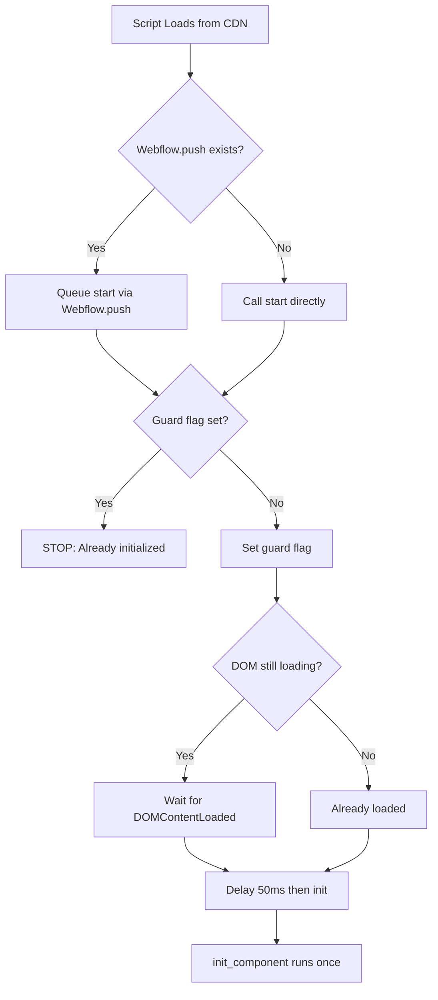

# Webflow CDN-Safe Initialization Pattern - Quick Reference

The mandatory CDN-safe initialization pattern for all JavaScript components in Webflow projects. 

This pattern ensures proper loading from CDN, prevents double initialization, respects Webflow's asynchronous architecture, and handles DOM readiness with appropriate delays.

---

## 1. ✅ THE ONLY CORRECT PATTERN

```javascript
(() => {
  const INIT_FLAG = '__componentNameCdnInit';  // Unique flag per component
  const INIT_DELAY_MS = 50;                     // Adjust per component needs

  function init_component() {
    // Your initialization code here
  }

  const start = () => {
    // Guard: Prevent double initialization
    if (window[INIT_FLAG]) return;
    window[INIT_FLAG] = true;

    // If DOM already loaded, delay before initializing
    if (document.readyState !== 'loading') {
      setTimeout(init_component, INIT_DELAY_MS);
      return;
    }

    // Otherwise, wait for DOMContentLoaded with delay
    document.addEventListener(
      'DOMContentLoaded',
      () => setTimeout(init_component, INIT_DELAY_MS),
      { once: true }
    );
  };

  // Prefer Webflow.push, fallback to immediate start
  if (window.Webflow?.push) {
    window.Webflow.push(start);
  } else {
    start();
  }
})();
```

**Pattern Components:**
- **INIT_FLAG** - Unique per component (e.g., `__accordionCdnInit`, `__heroVideoCdnInit`)
- **INIT_DELAY_MS** - Default 50ms, adjust based on component dependencies
- **start()** - Wrapper that checks guard and manages timing
- **init_component()** - Your actual business logic (unchanged)

---

## 2. ❌ COMMON MISTAKES TO AVOID

### Mistake 1: No Guard Flag (WRONG)
```javascript
// ❌ NEVER DO THIS - Allows double initialization on Webflow re-runs
const start = () => {
  if (document.readyState !== 'loading') {
    setTimeout(init_component, INIT_DELAY_MS);
    return;
  }
  // ...component initializes multiple times
};
```

### Mistake 2: No Delay (WRONG)
```javascript
// ❌ NEVER DO THIS - May run before DOM/dependencies ready
const start = () => {
  if (window[INIT_FLAG]) return;
  window[INIT_FLAG] = true;

  if (document.readyState !== 'loading') {
    init_component();  // Too early! Dependencies may not be ready
    return;
  }
  // ...
};
```

### Mistake 3: Direct DOMContentLoaded Without Guard (WRONG)
```javascript
// ❌ NEVER DO THIS - Ignores Webflow's loading system AND no double-init protection
document.addEventListener('DOMContentLoaded', init_component);
```

### Mistake 4: Using Old Simpler Pattern (WRONG for CDN)
```javascript
// ❌ NEVER DO THIS - Old pattern lacks guards and delays needed for CDN
if (window.Webflow && window.Webflow.push) {
  window.Webflow.push(init_component);
} else if (document.readyState === 'loading') {
  document.addEventListener('DOMContentLoaded', init_component);
} else {
  init_component();
}
```

---

## 3. 🎯 WHY THIS PATTERN?

### Core Requirements
1. **Guard Flag** - Prevents double initialization when Webflow re-triggers scripts
2. **Delayed Execution** - Ensures DOM and dependencies (Motion.dev, etc.) are fully ready
3. **Webflow.push Support** - Integrates with Webflow's native queueing system
4. **Fallback Logic** - Works even when Webflow.push unavailable
5. **Once-Only Listener** - `{ once: true }` prevents memory leaks

### Why Guards?
CDN-loaded scripts can be executed multiple times by Webflow's page transitions. The guard flag ensures initialization only happens once, even if the script runs multiple times.

### Why Delays?
The 50ms delay (default) ensures:
- DOM is fully parsed and stable
- External dependencies (Motion.dev, HLS.js) are loaded
- Webflow's own initialization is complete
- Race conditions are avoided

**When to adjust delay:**
- **0ms** - Component has zero dependencies (rare)
- **50ms** - Default for most components
- **100ms+** - Heavy dependencies or complex DOM queries

---

## 4. 📋 PATTERN CHECKLIST

Before deploying any script, verify:

- [ ] Wrapped in IIFE `(() => { ... })()`
- [ ] Has unique `INIT_FLAG` constant (e.g., `__accordionCdnInit`)
- [ ] Has `INIT_DELAY_MS` constant (default 50ms unless component needs different)
- [ ] Has `start()` wrapper function
- [ ] Guard check: `if (window[INIT_FLAG]) return;`
- [ ] Guard set: `window[INIT_FLAG] = true;`
- [ ] readyState check with setTimeout
- [ ] DOMContentLoaded with setTimeout
- [ ] Uses `{ once: true }` on event listener
- [ ] Checks `window.Webflow?.push` with optional chaining
- [ ] Has fallback `else` for when Webflow.push unavailable
- [ ] Business logic unchanged from previous version

---

## 5. 🔍 HOW IT WORKS



---

## 6. 📁 IMPLEMENTATION EXAMPLES

### Standard Component (Accordion)
```javascript
// src/accordion/accordion.js
(() => {
  function setupAccordion() {
    // Business logic unchanged
    document.querySelectorAll('[data-accordion-css-init]').forEach((accordion) => {
      // ... existing logic
    });
  }

  /* ─────────────────────────────────────────────────────────────
     INITIALIZE
  ────────────────────────────────────────────────────────────────*/
  const INIT_FLAG = '__accordionCdnInit';
  const INIT_DELAY_MS = 50;

  function initAccordion() {
    setupAccordion();
  }

  const start = () => {
    if (window[INIT_FLAG]) return;
    window[INIT_FLAG] = true;

    if (document.readyState !== 'loading') {
      setTimeout(initAccordion, INIT_DELAY_MS);
      return;
    }

    document.addEventListener(
      'DOMContentLoaded',
      () => setTimeout(initAccordion, INIT_DELAY_MS),
      { once: true }
    );
  };

  if (window.Webflow?.push) {
    window.Webflow.push(start);
  } else {
    start();
  }
})();
```

### Component with Global Export (Form Validation)
```javascript
// src/form/form_validation.js
(() => {
  function validate_form(form) {
    // ... validation logic
  }

  function validate_field(field) {
    // ... field validation
  }

  // Export API BEFORE guard (available immediately)
  window.FormValidation = {
    validate_form,
    validate_field,
    cleanup: () => {
      // ... cleanup logic
    }
  };

  /* ─────────────────────────────────────────────────────────────
     INITIALIZE
  ────────────────────────────────────────────────────────────────*/
  const INIT_FLAG = '__formValidationCdnInit';
  const INIT_DELAY_MS = 50;

  function init_form_validation() {
    // Auto-attach to forms
    document.querySelectorAll('form[data-validate]').forEach(validate_form);
  }

  const start = () => {
    if (window[INIT_FLAG]) return;
    window[INIT_FLAG] = true;

    if (document.readyState !== 'loading') {
      setTimeout(init_form_validation, INIT_DELAY_MS);
      return;
    }

    document.addEventListener(
      'DOMContentLoaded',
      () => setTimeout(init_form_validation, INIT_DELAY_MS),
      { once: true }
    );
  };

  if (window.Webflow?.push) {
    window.Webflow.push(start);
  } else {
    start();
  }
})();
```

### Self-Executing Component (Welcome Modal)
Some components export APIs but don't need delayed DOM initialization:

```javascript
// src/modal/modal_welcome.js
(() => {
  const INIT_FLAG = '__welcomeModalCdnInit';
  if (window[INIT_FLAG]) return;
  window[INIT_FLAG] = true;

  // Entire modal logic executes immediately
  window.AnobelWelcomeModal = {
    show: () => { /* ... */ },
    hide: () => { /* ... */ },
    // ... full API
  };
})();
```

---

## 7. 📊 ALL 34 FILES USING THIS PATTERN

This pattern is deployed across all JavaScript files:

**Core (13 files - currently in production CDN):**
1. accordion/accordion.js
2. browser/change_page_title_on_leave.js
3. browser/force_start_at_top.js
4. cms/conditional_visibility.js
5. footer/back_to_top.js
6. input/input_focus_handler.js
7. input/input_placeholder.js
8. label/label_office_hours.js
9. modal/modal_cookie_consent.js
10. navigation/language_selector.js
11. navigation/dropdown_menu.js
12. navigation/mobile_menu.js
13. text/copyright.js

**Additional (21 files - CDN-ready):**
- cms/related_articles.js
- form/form_submission.js, form_validation.js
- hero/* (5 files: blog_article, cards, general, video, webshop)
- link/* (2 files: grid, hero)
- marquee/* (2 files: brands, clients)
- modal/modal_welcome.js
- navigation/hide_nav_on_scroll.js
- tab/* (2 files: autoplay, menu)
- timeline/timeline.js
- video/* (4 files: hover_universal, play_on_hover, background_hls, player_hls)

---

## 8. 🚨 ENFORCEMENT

This pattern is:
- **Required** by Spec 006 (Cloudflare R2 CDN Setup)
- **Documented** in AGENTS.md (Required Reading)
- **Specified** in code_standards.md (Section 3.5)
- **Demonstrated** in all 34+ source files

### Pattern Evolution

**Previous pattern (pre-CDN):**
```javascript
// Old simpler pattern - NO LONGER USED
if (window.Webflow && window.Webflow.push) {
  window.Webflow.push(init_component);
} else if (document.readyState === 'loading') {
  document.addEventListener('DOMContentLoaded', init_component);
} else {
  init_component();
}
```

**Why we evolved:**
- ❌ No protection against double initialization
- ❌ No delays for dependency readiness
- ❌ Caused issues with CDN delivery
- ❌ Race conditions with Motion.dev and other libs

**Current pattern (CDN-safe):**
- ✅ Guard flags prevent double-init
- ✅ Delays ensure dependency readiness
- ✅ Proven reliable with CDN delivery
- ✅ Deployed across all 34 files

### References

- [specs/006-cloudflare-r2-cdn-setup/](../specs/006-cloudflare-r2-cdn-setup/) - Full CDN implementation spec
- [AGENTS.md](../AGENTS.md) - Required reading for all agents
- [code_standards.md](./code_standards.md) - Section 3.5: Initialization
- [animation_strategy.md](./animation_strategy.md) - Motion.dev integration

---

## 9. 🧪 QUICK VERIFICATION TEST

Add this to your page to verify the pattern is working:

```javascript
console.log('Initialization check:', {
  'Webflow.push available': !!(window.Webflow && window.Webflow.push),
  'DOM state': document.readyState,
  'Guard flags': Object.keys(window).filter(k => k.endsWith('CdnInit')),
  'Expected flow': window.Webflow?.push ? 'Webflow.push → start → guard → delay → init' :
                   document.readyState === 'loading' ? 'DOMContentLoaded → guard → delay → init' :
                   'Immediate → guard → delay → init'
});
```

---

**Remember**: When implementing new components, copy the pattern from Section 2 exactly. The guard flag and delay timing are not optional—they're critical for CDN reliability!